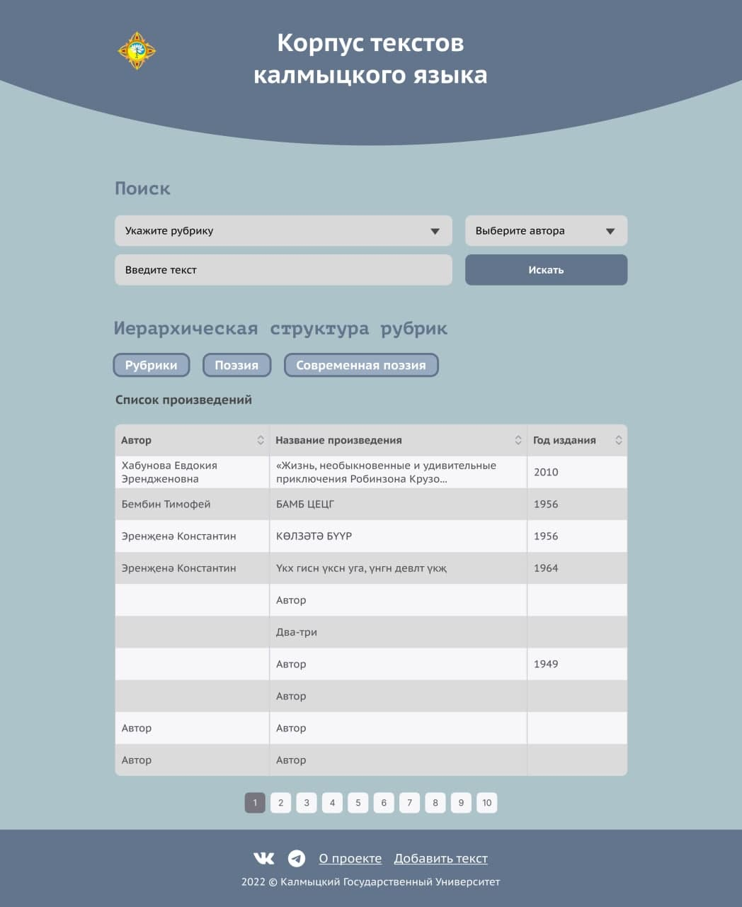

# Инструмент для работы с корпусом калмыцкого языка

> Корпус текстов калмыцкого языка.

## Описание

- Проект создан в образовательных целях по заказу Калмыцкого Государственного Университета им Б.Б.Городовикова



## Функциональность

- Автоматический поиск текстов на калмыцком языке по:
  - рубрике
  - автору
  - названию или отрывку произведения
- Ручной поиск и навигация по дереву документов
- Добавление нового текста в существующую базу произведений

## Установка

Чтобы запустить проект локально, используйте npm (CLI Node.js):

```
$ cd ./frontend
$ npm install
$ npm start
```

## Производственная сборка

Для финальной сборки проекта используйте npm (CLI Node.js):

```
$ npm run build
```
